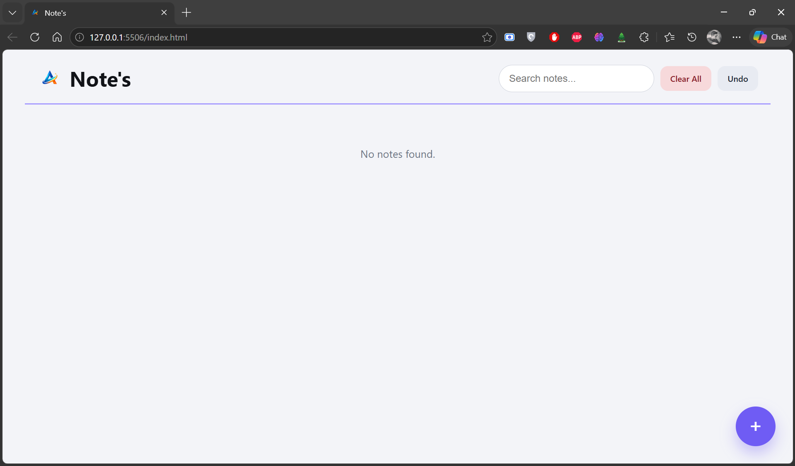

# Notes Saver 

## Overview
This project was built during my 12th standard as a personal tool to manage and organize my notes.
At that time, I needed a simple and quick way to store ideas, reminders, and study notes without relying on external apps.
So I decided to build my own notes application with features like saving, pinning, and searching notes.

## Features
- Create and save notes
- Pin important notes
- Search notes instantly
- Clean card-based UI layout
- Simple and distraction-free interface

## Tech Stack
- HTML
- CSS
- JavaScript

## What I Learned
- Managing dynamic data in the UI
- Designing card-based layouts
- Improving UI/UX significantly compared to earlier projects
- Implementing search functionality

## Screenshots

## How to Run
1. Clone or download this repository
2. Open `index.html` in your browser

## Project Level
Intermediate (Personal Productivity Tool)

## Note on Logo Usage
The logo used in this project is my personal brand identity.  
It is included only for demonstration purposes and should not be reused, redistributed, or used in other projects without permission.

## Growth Note
This project reflects a stage where I started building tools for my daily personal use, while also focusing heavily on improving UI design and usability.
